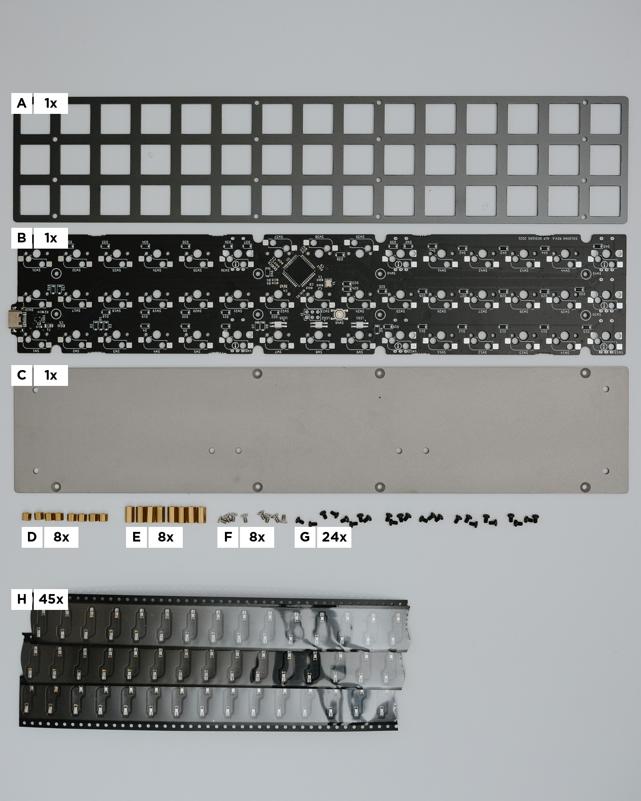
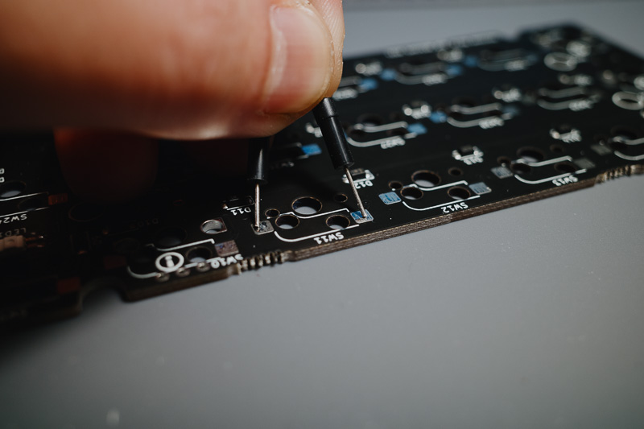
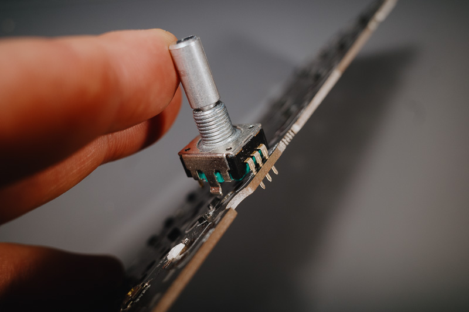
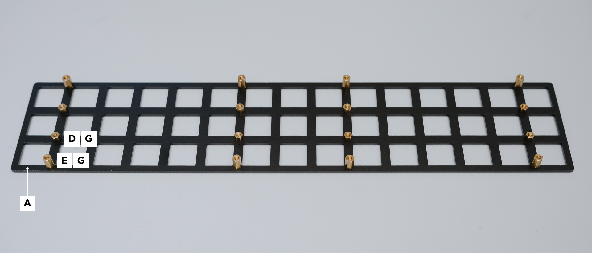
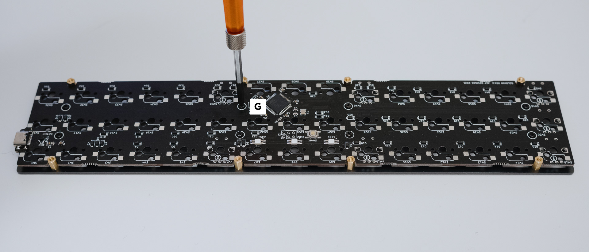

# Solovan Build Guide (Rev.A)

This build guide is translated from Japanese version. If there is any conflict, Japanese version should prevail.

Thank you for purchasing Solovan! 

Solovan is a 3x15 ortholinear keyboard. The board can be used as a depth saver or a adding some 40% to 60% keyboard. Also, it features 75 and 100 mm pitch M3 screw holes on the back side which is useful for attaching it to a display or a LCD tablet using commercially available hardwares (not included). Blasted stainless steel and dark grey anodised aluminum plate contributes its classy look and feel.

## Precautions

- This kit is for keyboard enthusiasts with proper knowledge of DIY keyboard.
- Some parts are fragile or may have sharp corners. Please handle with care.
- Sorry, but firmware development is not supported.

Products are carefully checked before shipment but please double-check for initial defects. If any problem, contact the seller within one week of receipt.

1. Check all parts are included in the box.
2. Check with [Remap](https://remap-keys.app) that all keys are working.

## Required Parts Not Included in the Kit

### Parts

|Item|Qty|
|:--|:--|
|Cherry MX key switch (or equivalent)|45|
|Cherry MX keycap 1u|45|
|Rotary encoder|3 max|
|Knob for rotary encoder|3 max|

Following rotary encoders can be used.

- ALPS EC12E2420801
- BOURNS PEC12R-4222F-S0024

### Equipments

|Item|Qty|
|:--|:--|
|USB Type-C data cable|1|
|Computer with Google Chrome (WebUSB must be enabled)|1|
|Tools|1 set|

Note: WebUSB may have been disabled in Google Chrome managed by your organization.

Following tools are recommended.

- Soldering iron and its holder
- Tweezers
- Side cutters
- Long-nose pliers or a M2 nut driver
- Screwdriver (+0)
- Solder and flux
- Solder wick
- Circuit tester with continuity check buzzer

## Inspection

### Parts in the Box

Following parts are included in this kit. Please check the quantity immediately after opening it.

|Symbol|Name|Qty|Rmks|
|:--|:--|:--|:--|
|A|Switch Plate|1||
|B|PCB|1||
|C|Bottom Plate|1||
|D|Standoff (M2x3.5 mm)|8|[Hirosugi ASB-2003.5CE](https://hirosugi.co.jp/products/B/ASB-CE.html) or equiv.|
|E|Standoff (M2x7.5 mm)|8|[Hirosugi ASB-2007.5CE](https://hirosugi.co.jp/products/B/ASB-CE.html) or equiv.|
|F|M2x4 stainless steel countersink screw|8|[Wilco UF-0204](https://wilco.jp/products/U/UF.html#page1) or equiv.|
|G|M2x3 black steel screw|24|[Wilco F-0230EB-03](https://wilco.jp/products/F/F-EB-03.html) or equiv.|
|H|Kailh MX socket|45||

### Inspecting the PCB

#### Inspecting Key Matrix

1. Access https://remap-keys.app with Google Chrome.
2. Connect Solovan.
3. Switch to key matrix testing mode.
    - 
4. Short the pair of pads for each switches.
    - 
5. Success if all switch except right cluster is highlighted. (The right cluster is for rotary encoders)
    - 

#### Inspecting Rotary Encoder Circuit

1. Assign `MO(1)`, `MO(2)` for rotary encoder keys.
    - 
2. Half insert the rotary encoder and try turning the shaft to the left and right. Make sure that three pins touch the hole wall.
    - 
3. Success if LED on the PCB flashes on rotating the encoder shaft.

## Assembling

### Choosing the place of rotary encoders

Rotary encoders can be placed on following footprints (Max 3). Footprint with the same number cannot be used at the same time. 

Rotary encoder functionality can be assigned using Remap.

### Assembling

1. Solder the Kailh socket.
    - **DO NOT solder to the footprints which are to be used with rotary encoders.**
    - Watch [Kailh socket soldering video](https://youtu.be/Mo56qdbEFzs) if needed.
    - Make sure not to solder sockets upside down.
2. Solder the rotary encoder.
    - Watch [rotary encoder soldering video](https://youtu.be/kJmX0Eaabzc) if needed.
    - If rotary encoders are too tight to plug them in, try bending their tab very slightly.
    - Trim the lead wires after soldering so that the remaining is ~2 mm. This is to prevent shortcircuit.
3. Attach standoffs to the switch plate.
    - **HANDLE WITH CARE: Aluminum plate is soft and prone to bend.**
    - Use standoffs `D` for inside holes and `E` for outside holes. Use screw `G`.
    - 
4. Attach the PCB to the switch plate.
    - use screw `G`.
    - 
5. Attach the bottom plate.
    - use screw `F`.
    - 
6. Attach rubber feets if needed.

## Setting Up Your Own Keymap

Navigating to https://remap-keys.app/ will let you edit your keymap.