# Solovan ビルドガイド (Rev.A)

- `2022-01-05` 背面プレートの向きについての記述を追加

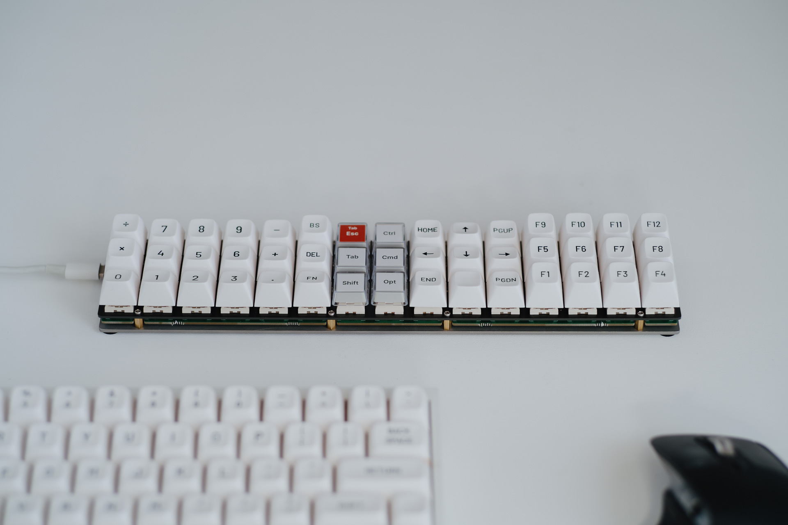

ご購入ありがとうございます．

Solovan は，3行15列のオーソリニアキーボードです．単体で奥行の狭いキーボードとして利用するほか， 60% キーボードに足りないキーを補う使い方をするなど，さまざまな使い方が可能です．また，背面には 75 mm, 100 mm 間隔で M3 の穴がきってあり，ディスプレイの背面の穴と市販の金物を利用してディスプレイや液晶タブレット等に取り付けることもできます．

本体は，アルミ合金製のスイッチプレートとステンレスの背面プレートにより，サンドイッチ構造でありながら高級感のある見た目を特徴としています．

## 使用上の注意

- 本キットは，自作キーボードについての適切な知識のある方を対象としています．
- 製品には，一部鋭利なパーツや壊れやすいパーツがありますので，注意して扱ってください．
- まことに申し訳ありませんが，ファームウェア開発や，開発環境の構築はサポート外とさせていただきます．

検品は可能な限り行っておりますが，組立前に必ず以下の手順で初期不良のないことを確認してください（後述）．不具合が見つかった場合，お手数ですが商品到着後1週間以内に購入先へご連絡ください.

1. 部品が全て揃っていることを確認する.
2. Remapで全てのキーが認識されていることを確認する.

## キット以外に必要なもの

### 部品

|品名|数量|
|:--|:--|
|Cherry MX キースイッチ 又は同等品|45個|
|Cherry MX 対応キーキャップ 1u|45個|
|ロータリーエンコーダ|最大3個|
|ロータリーエンコーダのつまみ|最大3個|

ロータリーエンコーダは，以下の型番で動作を確認しています．
- ALPS EC12E2420801
- BOURNS PEC12R-4222F-S0024

### 周辺機器・工具類

|品名|数量|
|:--|:--|
|データ通信可能な USB Type-C ケーブル|1本|
|WebUSB を有効にした Google Chrome が動作するコンピュータ|1台|
|工具|1式|

注意：組織で管理されたパソコンでは WebUSB が動作しないことがあります．

工具は以下のようなものがあると便利です．

- はんだごてとコテ台
- ピンセット
- ニッパー
- ラジオペンチ または ナットドライバー
- 精密ドライバー +0番
- はんだとフラックス
- はんだ吸い取り線
- テスター（導通時に音が鳴るもの）

## 動作確認

### 付属品の確認

本キットには，以下のものが含まれます．開封したらすぐに数量をご確認ください．

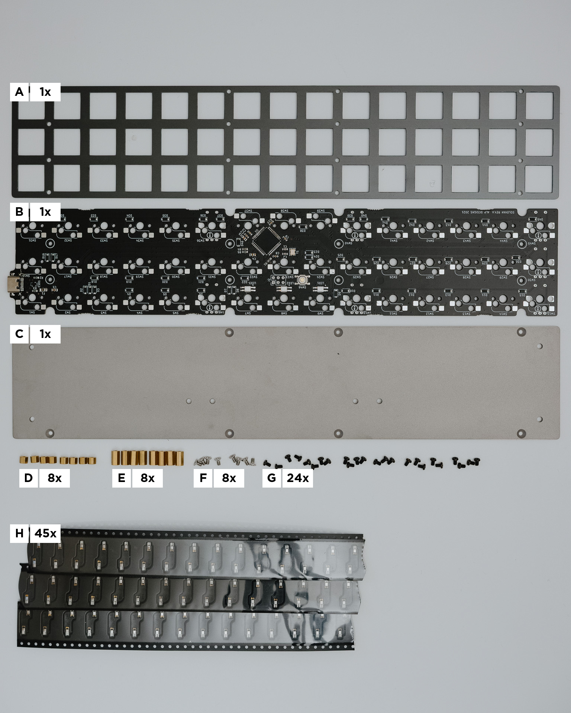

|記号|品名|数量|備考|
|:--|:--|:--|:--|
|A|アルミプレート|1枚||
|B|基板|1枚||
|C|背面プレート|1枚||
|D|スペーサー (M2x3.5 mm)|8個|[廣杉計器 ASB-2003.5CE](https://hirosugi.co.jp/products/B/ASB-CE.html) 又は同等品|
|E|スペーサー (M2x7.5 mm)|8個|[廣杉計器 ASB-2007.5CE](https://hirosugi.co.jp/products/B/ASB-CE.html) 又は同等品|
|F|M2x4 皿小ねじ ステンレス|8個|[ウィルコ UF-0204](https://wilco.jp/products/U/UF.html#page1) 又は同等品|
|G|M2x3 精密機器用 0番3種 ＋なべ小ねじ 鉄三価クロメート黒染|24個|[ウィルコ F-0230EB-03](https://wilco.jp/products/F/F-EB-03.html) 又は同等品|
|H|Kailh MX ソケット|45個||

### 基板の動作確認

#### キーマトリクスの動作確認

1. Google Chrome で https://remap-keys.app にアクセスします．
2. Solovan を接続します．
3. キーマトリクスのテストを行うモードに切り替えます．
    - 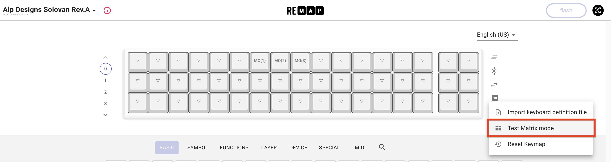
4. スイッチのパッドを針金などでショートします．
    - 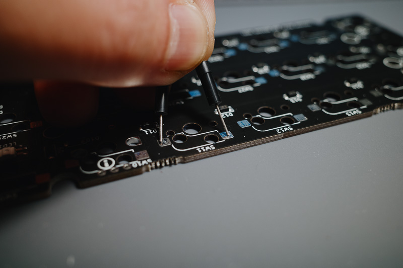
5. 以下のように全てのスイッチ部分に色がつけば成功です（右6つはロータリーエンコーダ用です）．
    - 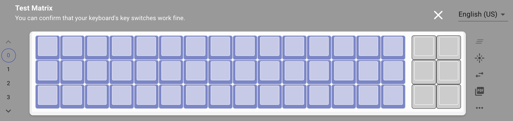

#### ロータリーエンコーダを使う場合

1. ロータリーエンコーダ設定用のキー（右端6つ）に `MO(1)`, `MO(2)` を割り当てます．
    - 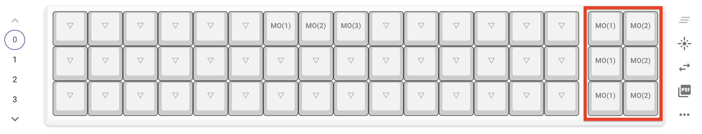
2. ロータリーエンコーダを半挿しにし，左右に回してみます．このとき，3本のピンが確実に穴の壁に触れるようにしてください．
    - 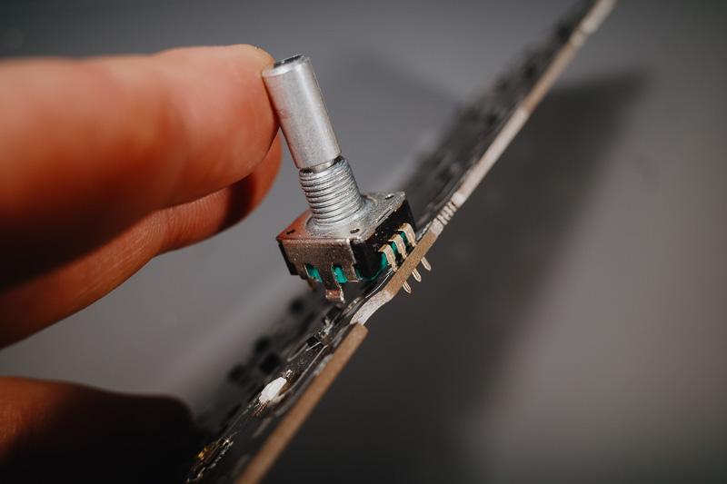
3. ロータリーエンコーダを回すたびに基板の LED が一瞬点灯すれば成功です．

## 組立手順

### ロータリーエンコーダの場所を選ぶ

ロータリーエンコーダは，以下の場所に最大3つ取り付けることができます．ただし，同じ番号の場所には同時に取り付けることができません．

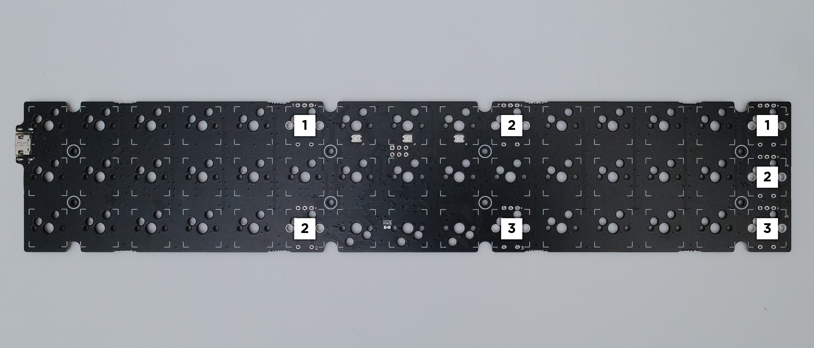

REMAP でロータリーエンコーダを回したときに送られるキーを設定できます．

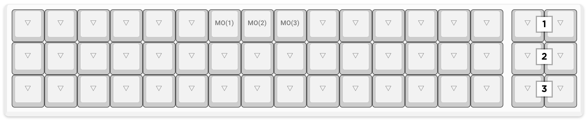

### 組立て

1. Kailh ソケットをはんだづけします．
    - **ロータリーエンコーダを装着する予定の位置にはソケットを取り付けないでください．**
    - 必要に応じて[Kailh ソケットのはんだづけ動画](https://youtu.be/Mo56qdbEFzs)を参考にしてください．
    - 向きを間違えないよう注意してください．
2. ロータリーエンコーダをはんだづけします．
    - 必要に応じて[ロータリーエンコーダのはんだづけ動画](https://youtu.be/kJmX0Eaabzc)を参考にしてください．
    - ロータリーエンコーダが固くて入らない場合，爪を内側または外側にわずかに曲げると入ることがあります．
    - はんだづけ後，足を 2 mm 程度残してニッパーで切り落とします．これはショートを防止するためです．
3. スイッチプレートにスペーサーを取り付けます．
    - 内側に背の低いスペーサー `D` ，外側に背の高いスペーサー `E` を取り付けます．使用するねじは `G` です．
    - アルミプレートは柔らかく，曲がりやすいので注意して扱ってください．
    - 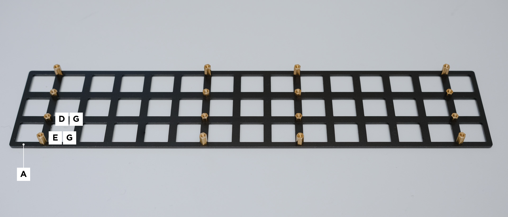
4. スイッチプレートに基板を取り付けます．
    - 使用するねじは `G` です．
    - 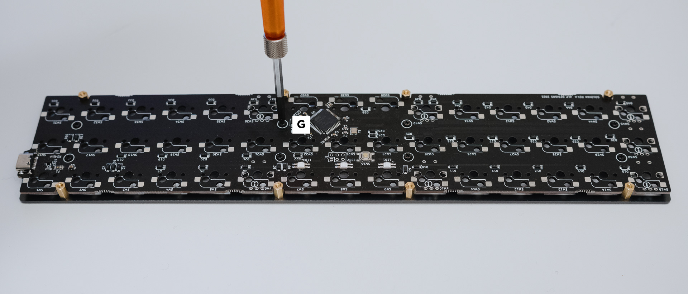
5. 背面プレートを取り付けます．
    - 使用するねじは `F` です．
    - `*1` USB端子と追加のねじ穴が中心に対して同じ側になるように取り付けてください．守らない場合，長すぎる追加のねじを使用すると，ねじの先端で基板の部品や配線を傷つけるおそれがあります．
    - 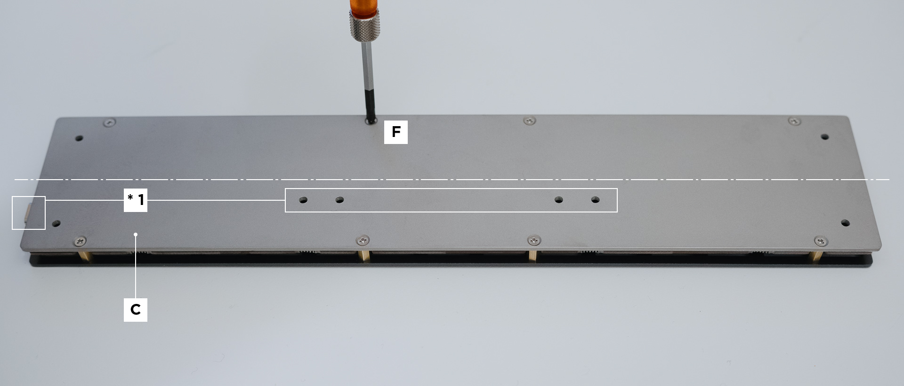
6. 必要な場合，ゴム足を取り付けます．

## キーマップの設定

https://remap-keys.app/ にアクセスすると，キーマップの設定画面が表示されます．